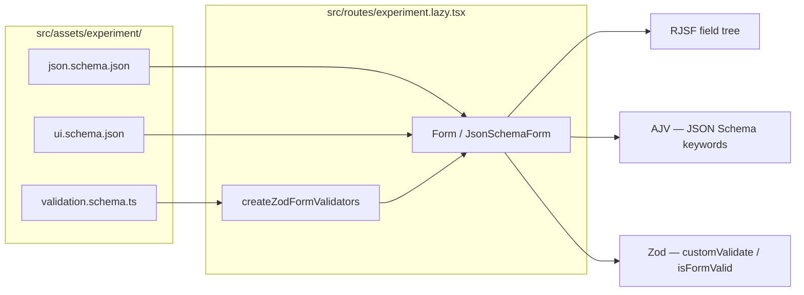

# Form assets — explanation

**Document type:** [Diátaxis](https://diataxis.fr/) **explanation** (understanding-oriented).

**Audience:** developers authoring or reviewing experiments under `src/assets/<experiment>/`.

**Goal:** understand what `json.schema.json`, `ui.schema.json`, and `validation.schema.ts` each do, how to write them, and how they connect at runtime.

For step-by-step tasks (add a route, change validation UX), see [project-guide.md](project-guide.md) (how-to sections).

---

## Roles and division of labor

Each experiment under `src/assets/<experiment>/` is a self-contained definition of one form. Three files split concerns on purpose:

| File | Answers | Does not own |
| ---- | ------- | ------------ |
| `json.schema.json` | What fields exist, their types, structure, and JSON Schema–expressible constraints | Friendly copy for every edge case, layout, or “if A then require B” when that logic is clearer in code |
| `ui.schema.json` | How RJSF should render fields (widgets, order, placeholders, integration-specific options) | The canonical data model or business rules |
| `validation.schema.ts` | Typed `formData` shape, user-facing messages, cross-field and conditional rules | Widget choice or field visibility (those follow schema + uiSchema + RJSF) |

At runtime a route imports all three, passes `schema` and `uiSchema` into `Form`, and wires Zod through `createZodFormValidators`. RJSF builds the field tree from JSON Schema, decorates it with uiSchema, validates structurally with AJV, then runs your Zod `customValidate` so errors and submit state share one parse.

Think of **json.schema.json** as the contract for `formData`, **ui.schema.json** as presentation hints on top of that contract, and **validation.schema.ts** as the place for rules and messages that are awkward, repetitive, or invisible in pure JSON Schema.

---

## Writing `json.schema.json`

This file is standard [JSON Schema Draft 2020-12](https://json-schema.org/draft/2020-12/schema) (the repo uses AJV 2020). It is what RJSF uses to decide which fields to render, how values are typed, and which keywords AJV can enforce.

**Start from the root object.** Every experiment is typically a top-level `type: "object"` with a `properties` map. Property names become keys in `formData` and must stay stable—they are the IDs Zod paths and uiSchema keys refer to.

**Use schema keywords for structure and simple constraints:**

- `type`, `properties`, `required` — shape and mandatory fields
- `minLength`, `maxLength`, `minimum`, `pattern`, `format` (`date`, `time`, …) — per-field limits AJV understands
- `items`, `minItems`, `maxItems`, `uniqueItems` — arrays (including multi-select checkboxes)
- `$defs` + `$ref` — reusable fragments (see `byCorporateBenefit` in `payment-methods/json.schema.json`)
- `allOf` / `if` / `then` — conditional appearance of properties when a value is set (payment method includes `corporate_benefit` → show `byCorporateBenefit`)

**Titles and descriptions** on properties become default labels and help text unless uiSchema overrides them.

**Choosing allowed values** — the integration supports several patterns; pick one per field:

| Pattern | When to use | Example in repo |
| ------- | ----------- | ----------------- |
| `enum` (+ optional `enumNames`) | Simple string lists, especially long static lists | `byPrivateInsurance` in payment-methods |
| `options: [{ id, label, description? }]` + matching `oneOf: [{ const }]` | Stable stored values (`id`) with rich labels; works well with custom widgets | `paymentMethod` items, triage enums |
| `oneOf` branches with `const` | RJSF-native option lists when you do not need `id`/`label` objects | Same files, paired with `options` |

For `options`, **`id` is the value stored in `formData`**; `label` (and optional `description`) are display-only. Pair each `id` with a `oneOf` entry `{ "const": "<same id>" }` so JSON Schema still describes the allowed set for AJV. Widgets resolve labels via `resolveEnumOptions` in `src/integration/shadcn/resolveEnumOptions.ts`. For `type: "array"` fields (e.g. checkboxes), put `options` / `oneOf` on **`items`**, not only on the array schema—the resolver unwraps `items` automatically.

**Conditional fields:** JSON Schema `if`/`then` (often inside `allOf`) tells RJSF which properties exist for the current data. That drives which inputs appear; it does not replace Zod for nuanced messages or rules that depend on multiple fields at once. The payment-methods schema adds `byCorporateBenefit` when `paymentMethod` contains `corporate_benefit`; Zod in `validation.schema.ts` enforces the same business rules with clearer errors.

**What to keep here vs elsewhere:** types, cardinality, enums, formats, and schema-level conditionals belong in JSON Schema. Duplicating every conditional message in both AJV and Zod is optional—this repo often uses Zod as the source of user-facing errors (`replaceSchemaErrors: true` by default) while JSON Schema still shapes the form.

---

## Writing `ui.schema.json`

uiSchema is [RJSF’s presentation layer](https://rjsf-team.github.io/react-jsonschema-form/docs/api-reference/uiSchema): parallel to `json.schema.json`, keyed by property name, with `ui:` prefixes. It never changes the data model; it changes widgets, order, and widget-specific options consumed by this repo’s Shadcn theme.

**Common keys:**

| Key | Effect |
| --- | ------ |
| `ui:widget` | Widget id (`checkboxes`, `radio`, `select`, `textarea`, `alt-date`, `time`, …) — see widgets in `src/integration/shadcn/widgets/` |
| `ui:order` | Array of property names for display order (sibling fields under the same object) |
| `ui:placeholder` | Placeholder text for text-like widgets |
| `ui:options` | Widget/template options (e.g. `inline`, `label: false`, `yearsRange` for alt-date) |

**Nesting mirrors the JSON Schema tree.** For a property `groups` that is an array with tuple `items`, uiSchema uses `groups.items[0]` and `groups.items[1]` for per-index layout—see `internal-triage-form/ui.schema.json`.

**Project-specific: `checkboxNestedFields`.** Under `ui:options` (field-level or `ui:options` at the root), this map tells the checkbox/radio integration to show nested fields beside the option that activated them—for example `corporate_benefit` → `["byCorporateBenefit"]`. Keys are option **values** (`id` / `const`), values are arrays of sibling property names. Use this when JSON Schema `if`/`then` already adds those properties but you want them visually grouped under the checkbox or radio that triggered them.

**Omit uiSchema when defaults suffice.** If standard RJSF widgets and schema `title`s are enough, you can skip the file and pass only `schema` to `Form`.

---

## Writing `validation.schema.ts`

This TypeScript module is not loaded by RJSF directly. It defines a **Zod** schema that mirrors the shape of `formData` produced by the JSON Schema form, plus exports for the route:

1. `export const …ZodSchema = z.…` — the validator
2. `export type …FormData = z.infer<typeof …ZodSchema>` — typed submit handler

**Property paths must match JSON Schema keys** (including array indices in paths like `['groups', 0, 'triageDecision']`) so `applyZodIssuesToFormValidation` attaches errors to the correct fields.

**Typical structure:**

1. **Const tuples** for allowed enum values (keeps Zod in sync with `options` / `enum` ids).
2. **`z.object({ … })`** with fields mostly optional at the leaf level when conditionals mean “sometimes absent.”
3. **`z.preprocess`** when RJSF might send slightly loose shapes (e.g. normalize `paymentMethod` to `string[]`, or `groups` to a fixed-length tuple)—see payment-methods and internal-triage validators.
4. **`.superRefine()`** (or `.refine()`) for conditional requirements: if `paymentMethod` includes `corporate_benefit`, require `byCorporateBenefit`; if `byCorporateBenefit === 'other'`, require `byCorporateBenefitOther` with min length. Prefer `ctx.addIssue({ path: ['fieldName'], message: '…' })` for field-level errors.

**Relationship to JSON Schema validation:** AJV still runs on JSON Schema keywords. Zod runs in `customValidate` and, by default, clears AJV messages at the same paths so users see one message per field—usually Zod’s. `isFormValid` uses the same cached `safeParse`, which powers submit disabling in `submitThenChange` mode.

**Do not configure AJV in the route.** `JsonSchemaForm` owns the validator; the route only passes `createZodFormValidators(schema)` as `customValidate`.

For how AJV and Zod interact with submit UX, see [Validation: AJV and Zod together](project-guide.md#validation-ajv-and-zod-together) in the project guide.

---

## How the three files work together (end-to-end)

1. **Build time:** Vite imports `json.schema.json` and `ui.schema.json` as JSON modules; `validation.schema.ts` is compiled TypeScript.

2. **Mount:** The route renders `Form` with `schema`, `uiSchema`, and `customValidate` from `createZodFormValidators(yourZodSchema)`.

3. **Render:** RJSF walks `json.schema.json`, applies `ui.schema.json` per field, and uses the local theme (widgets/templates). Conditional branches from `if`/`then` add or remove properties; `checkboxNestedFields` controls nested layout for checkboxes/radios.

4. **Edit:** User input updates `formData`. Enum widgets read allowed values from schema (`options`, `enum`, or `oneOf`).

5. **Validate:** On submit or live validation (depending on `validationMode`), AJV checks JSON Schema rules, then Zod runs via `customValidate`. Issues map to RJSF `errorSchema`; templates/widgets respect `FormValidationContext` for when to show errors.

6. **Submit:** `onSubmit` receives `formData` typed as `z.infer<typeof yourSchema>` when the route imports that type.

**Practical split for new experiments:**

- Add a property in **json.schema.json** first (type, title, constraints, conditionals).
- Tune appearance in **ui.schema.json** if the default widget or order is wrong.
- Mirror the shape in **validation.schema.ts** and add `.superRefine` rules for anything users should feel as “business validation” or custom copy.

**Reference implementations:**

| Experiment | Path | Good for |
| ---------- | ---- | -------- |
| Payment methods | `src/assets/payment-methods/` | Arrays, `options`, `allOf`, nested checkboxes |
| Internal triage | `src/assets/internal-triage-form/` | Tuple arrays, dates/times, nested `checkboxNestedFields` inside array items |

---

## Related reading

- [project-guide.md](project-guide.md) — tutorial, how-tos, and broader architecture
- [React JSON Schema Form — uiSchema](https://rjsf-team.github.io/react-jsonschema-form/docs/api-reference/uiSchema)
- [JSON Schema Draft 2020-12](https://json-schema.org/draft/2020-12/schema)
- [Zod](https://zod.dev/)
